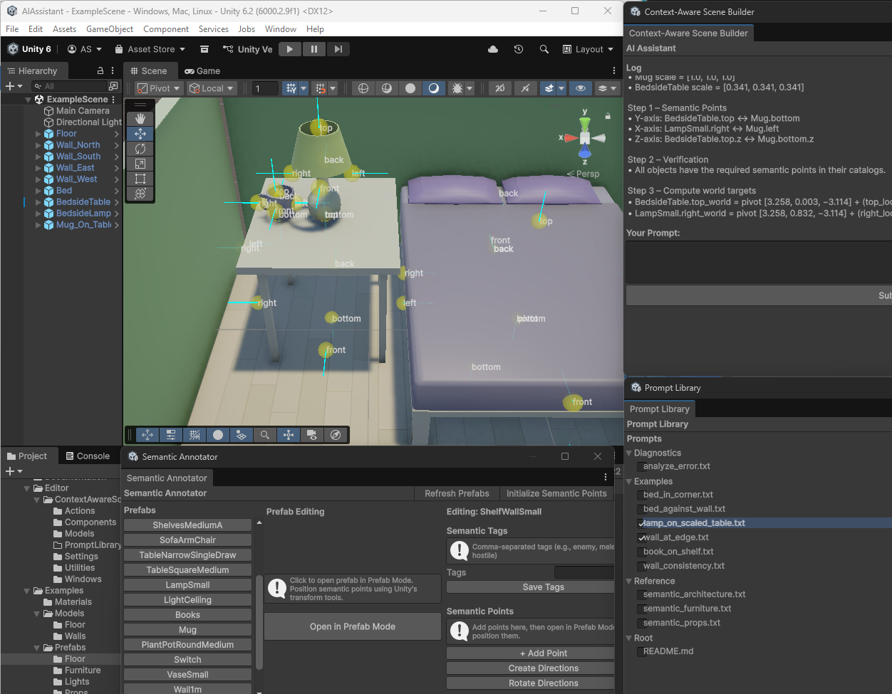

# Context-Aware Scene Builder



A Unity Editor plugin for building scenes with natural language using OpenAI's o4-mini.

```
"Create a 4x4 meter floor"
"Add walls around all edges"
"Place a bed against the north wall"
"Put nightstands on both sides with lamps on top"
```

The AI uses semantic metadata (named points with normals) and spatial reasoning to place and rotate objects correctly.

## Requirements

- Unity 6.2
- OpenAI API key (uses o4-mini model)

## Setup

1. Add prefabs to your project
2. Open `Window > Context-Aware Scene Builder > Semantic Annotator`
3. Annotate prefabs with semantic points (front, back, top, bottom with normals)
4. Open `Window > Context-Aware Scene Builder > Prefab Categories` and scan prefabs
5. Configure your OpenAI API key in settings
6. Open `Window > Context-Aware Scene Builder > Scene Builder` and start building

## Scene Builder (Main Window)

The primary interface for building scenes.

**What it does**:
- Chat interface with conversation history
- Type natural language commands
- AI proposes actions in a checkbox list
- Approve selected actions or reject all
- Multi-turn conversations with context

**Workflow**:
1. Type a command: "Place a lamp on the table"
2. AI analyzes scene context and proposes actions
3. Review proposed actions (instantiate lamp at position X, rotation Y)
4. Check boxes for actions you want
5. Click "Execute Selected"
6. Full undo support

**Examples**:
- "Create a 4x4 floor at the origin"
- "Add walls around the floor edges"
- "Place a bed against the north wall"
- "Make it bigger" (continues conversation)
- "Delete the lamp"
- "Add a Rigidbody with mass 10 to the bed"

The AI understands spatial relationships (on, against, next to, between) and calculates positions/rotations using Semantic Local Space math.

## Semantic Annotator

Tool for adding semantic metadata to prefabs.

**What it does**:
- Batch initialize `SemanticPoints` containers for multiple prefabs
- Open individual prefabs in Prefab Mode for detailed editing
- Add directional points (front, back, left, right, top, bottom)
- Set normal vectors for each point (visualized as blue arrows)
- "Rotate Directions" button to fix pre-rotated meshes

**Why this matters**:
Semantic points tell the AI how objects should align. A table has "top" with normal [0,1,0]. A lamp has "bottom" with normal [0,-1,0]. The AI places lamp.bottom on table.top with opposing normals.

Without semantic points, the AI would guess based on object names and bounds, leading to incorrect rotation and positioning.

**Workflow**:
1. Select prefabs from the list
2. Click "Initialize Semantic Points for All" to create containers
3. For each prefab, click "Open in Prefab Mode"
4. Add directional points using the Unity hierarchy
5. Set normals in the inspector or use "Rotate Directions" helper
6. Save prefab changes

**How normals work**:
- front: direction object "faces" (usually +Z in SLS)
- back: opposite of front
- top: upward surface (usually +Y)
- bottom: downward surface (usually -Y)
- left/right: side surfaces

Normals must point **outward** from surfaces for correct alignment.

## Prefab Categories

Configures which prefabs are available to the AI.

**What it does**:
- Set scan folder path
- Trigger prefab scanning
- View scan results (prefab count, components found, semantic points detected)
- Manage prefab tags/categories

**How scanning works**:
1. Finds all prefabs in configured folder
2. Extracts component metadata via reflection (public fields, [SerializeField] private fields)
3. Reads semantic points from `SemanticPoints` container
4. Calculates `R_ls` (local-to-SLS rotation) from front/top normals
5. Generates OpenAI function schemas for each prefab
6. Saves to `PrefabRegistry.json`

The AI receives this metadata and generates tool calls like `createBedroomBed(position, rotation, parameters)`.

## Prompt Library

Manages teaching examples that guide AI behavior.

**What it does**:
- Browse included examples in tree view
- Enable/disable individual prompts
- Preview prompt content
- See which prompts are currently active

**Included examples**:
- **lamp_on_scaled_table.txt**: How to handle scaled objects (shows SLS math)
- **wall_consistency.txt**: Why all 4 walls must use same semantic point (front OR back, not mixed)
- **bed_against_wall.txt**: Furniture placement patterns
- **semantic_furniture.txt**: Conventions for beds, chairs, tables, shelves
- **semantic_props.txt**: Conventions for lamps, books, decorative objects
- **semantic_architecture.txt**: Conventions for walls, floors, ceilings, doors
- **analyze_error.txt**: Diagnostic that forces AI to show calculation steps

Enabled prompts are automatically injected into the system message. They teach the AI common patterns and pitfalls.

**Advanced**: Users can write custom examples in the `Fixes/` folder (requires understanding SLS math and prompt engineering). See `architecture_promptlibrary.md` for details.

## Key Features

**Multi-turn conversations**: The AI maintains context. Say "make it bigger" or "delete that one" without repeating yourself.

**Spatial reasoning**: Understands "against the north wall", "on both sides", "evenly spaced around the table" without exact coordinates.

**Component management**: "Add a Rigidbody with mass 10", "Set the car's speed to 150". Modifies component fields via reflection using namespaced parameters (ComponentType_fieldName).

**Semantic Local Space (SLS)**: Handles different mesh orientations. Your floor has front=+Z, but a downloaded asset has front=+X. SLS normalizes this to a canonical frame (Front=+Z, Up=+Y, Right=+X) so rotation calculations are deterministic.

**Approval workflow**: All actions appear in a checkbox list. Approve what you want, reject the rest. Nothing happens without your approval.

**Object tracking**: Tracks objects across conversation turns via Unity instanceID. "Make the bed bigger" - the AI knows which bed you mean from previous context.

## How It Works (Technical)

**Semantic Local Space (SLS)**:
Each prefab has a rotation `R_ls` that transforms from local space (arbitrary mesh axes) to Semantic Local Space (canonical Front=+Z, Up=+Y, Right=+X). Calculated from front and top semantic point normals.

Formula: `R_world = R_sls_final * R_ls`

Where:
- `R_sls_final` = alignment rotation calculated in SLS (lamp.bottom → table.top)
- `R_ls` = prefab's local-to-SLS rotation
- `R_world` = final Unity world rotation (quaternion)

**Two-vector alignment**:
1. Primary: Align contact normals (lamp.bottom [0,-1,0] opposes table.top [0,1,0])
2. Secondary: Remove twist around contact normal using reference up vector
3. Result: `R_sls_final = q2 * q1`

Position calculation happens in world space. Semantic points are unscaled in scene context; scale applied during conversion.

See `SLS_MATH_README.md` for complete mathematical specification.

## Common Issues

**Objects placed at wrong position**:
- Check semantic points exist (use Semantic Annotator)
- Verify normals point in correct directions (use gizmo visualization)
- Enable `analyze_error.txt` in Prompt Library to see AI's calculation
- Check console for `R_ls` calculation warnings

**Objects facing wrong direction**:
- Verify `front` and `top` semantic points exist
- Check normals aren't inverted
- Use "Rotate Directions" button if mesh is pre-rotated
- Review `SLS_MATH_README.md` for rotation conventions

**Walls not symmetric**:
Common error: mixing wall.front and wall.back between walls creates asymmetric rooms (one wall intrudes 0.121m).

Solution: Use same semantic point (all back OR all front) for ALL walls. See `wall_consistency.txt` example.

**Scale issues**:
Verify scene context shows UNSCALED SLS offsets. Scale should be applied once during world conversion, not twice. Normals are never scaled (they're unit directions).

## Performance

- Reflection only during prefab scanning (not instantiation)
- FieldInfo cached in memory after deserialization
- Scene indexing uses SHA256 hashing to skip unchanged data
- OpenAI manages conversation state server-side via `previous_response_id`
- Token budget with automatic truncation for large scenes

## Limitations

- Requires manual semantic point annotation
- Object tracking via instanceID (session-only, invalid after scene reload)
- OpenAI API costs (o4-mini is inexpensive but monitor usage)
- Unity 6.2 only

## Documentation

- `SLS_MATH_README.md` - Mathematical specification for rotation calculations
- `architecture_normals.yaml` - SLS architecture details
- `architecture_objectmodification.yaml` - Object tracking and modification system
- `architecture_promptlibrary.md` - Prompt library design and advanced customization
- Prompt Library examples with step-by-step SLS workflows

## License

MIT

---

Annotate prefabs with semantic points, then build scenes by describing what you want. The AI handles spatial reasoning and rotation math using Semantic Local Space.
